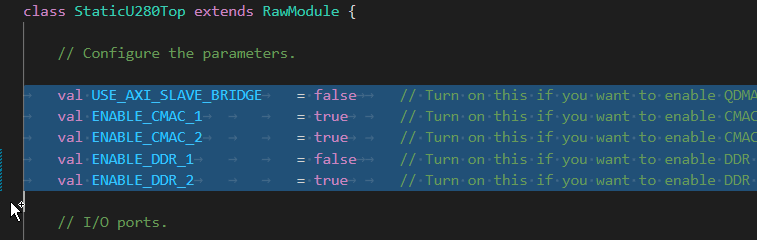
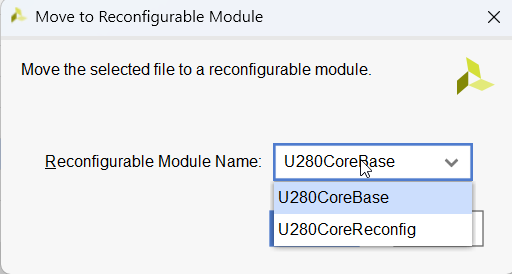
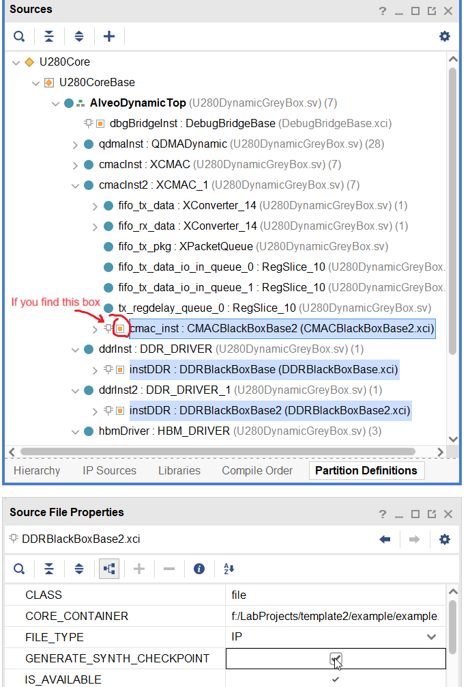
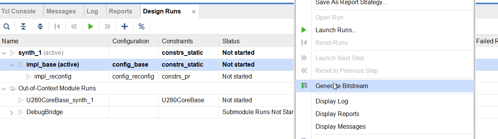

# Step-By-Step Tutorial to Build a Project

1. Please make sure you have already installed mill https://com-lihaoyi.github.io/mill/mill/Intro_to_Mill.html, just as regular chisel projects.

2. Clone this repo to your machine and install all the submodules.   
    i.e. 
    ```bash
    git clone git@github.com:RC4ML/rc4ml_static.git --recursive
    ```

3. Create a template Vivado project.  

    Open the `static/vivado` folder, copy `rc4ml_static_<board>.srcs` and `build_project_<board>_<version>.tcl` to anywhere you want to build the project (the project will be built in a subdirectory, so you don't have to choose an empty directory).  

    Then, open vivado. Do not open any project, instead, switch to the folder you put the files and run the script (`source build_project_<board>_<version>.tcl `), a template project with necessary files will be automatically created.   

    You can also change the project name by setting arguments, for example:
    ```tcl
    set user_project_name example
    source build_project_u280_202101.tcl
    ```
    

4. Configure the static part. Each board in `static/src` folder has two files, namely `Static<board>Top.scala` and `<board>DynamicGrayBox.scala`. The former one is the top module of static part, and the latter one is a sample of reconfigurable part. Here, open the `Static<board>Top.scala` file, and edit the parameters to meet your own need.
      
    Note that you DO NOT have to edit any options if you want to enable/disable HBM, since HBM isn't connected to any I/O port of FPGA board.   

    After this, create a new file `config.json` in the root path of this repo, and edit target position to put the generated .sv files. An example of `config.json` is as followed:
    ```json
    {
      "static" : {
          "destIPRepoPath" : "/home/username/example_project/example_project.srcs/sources_1/imports/ip",
          "destSrcPath" : "/home/username/example_project/example_project.srcs/sources_1/imports/new",
          "moniterDelay" : 6
      }
    }
    ```
5. Elaborate the static part file. Take Alveo U280 as an example, to replace the verilog files in the Vivado project, run the following commands:
    ```bash
    python3 postElaborating.py static StaticU280Top -t -p
    ```
    If you configure your `config.json` right, you'll find static part of the project is already replaced by the newly generated file.  

    Note that this time the terminal may output some tcl scripts like below, if you enable DDR in your design:  
      
    The scripts consists of one or multiple modules, each two lines, one begins with `create_ip`, one begins with `set_property`.    

    Now, open the "Hierarchy" tab of the Vivado, open the base module and check whether each IP exists:
      
    If a module doesn't exist, copy *all two lines* (i.e., both `create_ip` and `set_property` lines) of the tcl script to the Tcl Console. If a module exists, copy *only the second line* (i.e., `set_property` line) to the Tcl Console.  

6. Configure the reconfigurable part. This repo provides a graybox sample to generate a base implementation, which can be replaced by your own logic later. Open the `<board>DynamicGrayBox.scala` file, and edit the parameters. **Make sure your choices is same as edited in** `Static<board>Top.scala`, besides you should set whether to ennable HBM, like this:
      

7. Elaborate the reconfigurable part file. Take Alveo U280 as an example, to replace the verilog files in the Vivado project, run the following commands:
    ```bash
    python3 postElaborating.py static U280DynamicGreyBox -t -p
    ```
    Note that this time the terminal may output some tcl scripts like below:
      
    Similar to Step 5, now open the "Partition Definitions" tab of the Vivado, open the base module and check whether each IP exists:  
      
    If a module doesn't exist, copy *all two lines* (i.e., both `create_ip` and `set_property` lines) of the tcl script to the Tcl Console. If a module exists, copy *only the second line* (i.e., `set_property` line) to the Tcl Console.  

    You may find some IPs still missing in "Partition Definitions" tab, and instead, they appear in "Hierarchy" tab. Right click on these modules, and select "Move to Reconfigurable Module" like below:  
      
    And choose the base module.  
      
    Sometimes this might not work due to Vivado's bug, if this occurs, just try again until they successfully moved to the reconfigurable part.  

    For each newly-moved IPs (i.e., with orange box on the left, **except DebugBridgeBase**), please untick the "GENERATE_SYNTH_CHECKPOINT" in the "Properties" tab, until the box disappears.  
      

8. Adjust constraints to your own need. Constraint of base configuration is placed in `rc4ml_static_<board>.srcs/constrs_static/new/constr_base.xdc` folder. You may comment or uncomment some lines according to the following table:  
    | Lines Start with   | When to Uncomment (Enable) | When to Comment (Disable) |
    | ------------------ | ------------------------- | ------------------------ |
    | From QDMA Module   | Always | Never |
    | From CMAC Module   | You're using AT LEAST 1 CMAC module in your design.<br> i.e. `ENABLE_CMAC_1 == true \|\| ENABLE_CMAC_2 == true`. | Otherwise |
    | From HBM Module    | You're using HBM module in your design.<br> i.e. `ENABLE_HBM == true` | Otherwise |
    | From DDR Module (DDR 0) | You're using DDR at channel 0. <br> i.e. `ENABLE_DDR_1 == true` | Otherwise |
    | From DDR Module (DDR 1) | You're using DDR at channel 1. <br> i.e. `ENABLE_DDR_2 == true` | Otherwise |
    | PBlocks (No DDR, with HBM) | You're not using any DDR. <br> i.e. `ENABLE_DDR_1 == false && ENABLE_DDR_2 == false` | Otherwise |
    | PBlocks (1 DDR, with HBM) | You're using DDR at channel 1. <br> i.e. `ENABLE_DDR_2 == true` | Otherwise |
    | PBlocks (2 DDRs, no HBM) | You're using DDR at channel 0. <br> i.e. `ENABLE_DDR_1 == true` | Otherwise |
    | PBlocks (Commonly used) | Always | Never |
    | User-constrained logic | Always | Never |
    | Debugging | Always | Never |
    | Debugging (no HBM) | You're not using HBM module in your design.<br> i.e. `ENABLE_HBM == false` | Otherwise |

9. Run implementation of the base configuration and check if QDMA works. Just launch `impl_base` run and check the bitstream file.  
      

10. Create your own configuration of the reconfigurable part. You are recommended to create a new Chisel project other than reusing this one. For the reconfigurable part, the top module should follow these restrictions:

    - Module name should be `AlveoDynamicTop`. You can clone the graybox module and change the module name as your own top module.
    - S_BSCAN ports and debug bridge should be added if you want to add any ILAs or VIOs to the reconfigurable part. For convenience, you can keep `DebugBridge` in your reconfigurable part even if you don't have any ILA/VIO.

    Besides, you should configure constraint file in `rc4ml_static_<board>.srcs/constrs_pr/new/constr_pr.xdc` at your own needs, like in Step 8. 

    You can first first try [QDMA examples](../qdma/README.md), follow its detailed guide to get used to this workflow. 