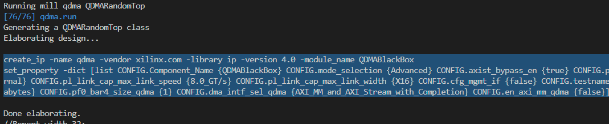
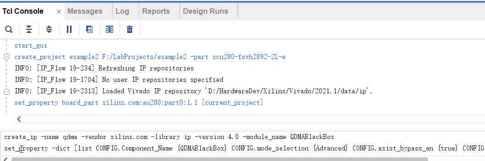
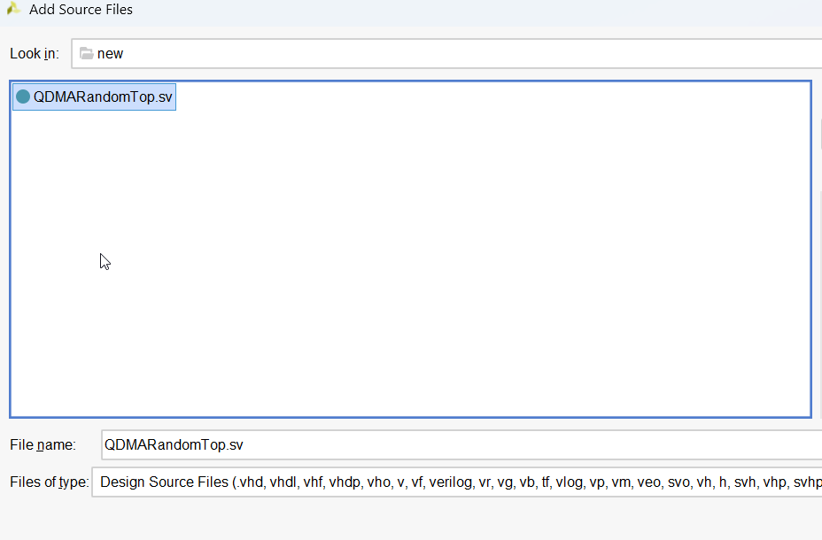
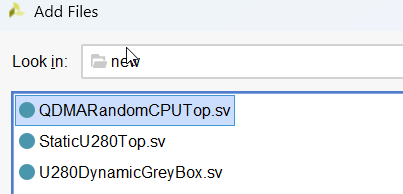

# RC4ML QDMA Chisel Package

RC4ML QDMA hardware repo. 

*If you are searching for QDMA software library, please see [this repo](https://github.com/RC4ML/rc4ml_qdma).*

## Structure of this Repo

This repo is organized as follows:

- **src**: Chisel source codes.   

  Here lists some of the noticable files:

  - **QDMA.scala**: The main QDMA module. If you want to use QDMA for your chisel project without partial reconfiguration, call `qdma = Module(new QDMA)` to instantiate it.
  - **QDMADynamic.scala**: The main QDMA module for partial reconfiguration workflow, and should be instantiated in the reconfigurable/dynamic region. Call `qdma = Module(new QDMADynamic)` to use it. 
  - **Elaborate.scala**: An example of elaboration script. Edit this to add new examples / components to this project. 

  Here lists subfolders of `src`:

  - **examples**: Some usage examples, corresponding to example software codes in [QDMA Software Lib](https://github.com/RC4ML/rc4ml_qdma).
    - **basic**: For basic workflow without partial reconfiguration.
      - **AXILBenchmarkTop.scala**: Chisel code for software `axil_latency` example.
      - **QDMALatencyTop.scala**: Chisel code for software `qdma_latency` example.
      - **QDMARandomTop.scala**: Chisel code for software `qdma_random` example.
      - **QDMATop.scala**: Chisel code for software `qdma_throughput` example.
    - **partialReconfig**: For partial reconfiguration workflow. 
      - **QDMAAXILBenchmarkTop.scala**: Chisel code for software `axil_latency` example.
      - **QDMALatencyCPUTop.scala**: Chisel code for software `qdma_latency` example.
      - **QDMARandomCPUTop.scala**: Chisel code for software `qdma_random` example.
      - **QDMAThroughputCPUTop.scala**: Chisel code for software `qdma_throughput` example.
      - **QDMAThroughputGPUTop.scala**: Chisel code for software `qdma_gpu` example. 
    - **util**: Code for some used benchmark components. If you want to write your own code, you're *NOT recommended* to use these components, i.e., include the `qdma.examples` package since it might be changed at any time.

## List of Example Projects

### Basic Workflow

| Elaborate Name | Software Binary Name | Description |
| -------------- | -------------------- | ----------- |
| QDMATop        | qdma_throughput      | Benchmark sequential throughput of the DMA engine and the AXI Bridge BAR. |
| QDMARandomTop  | qdma_random          | Benchmark random throughput of the DMA engine. |
| QDMALatencyTop | qdma_latency         | Benchmark latency of the DMA engine. |
| AXILBenchmarkTop | axil_latency       | Benchmark throughput and latency of the AXI Lite BAR. |

### Partial Reconfiguration Workflow

| Elaborate Name | Software Binary Name  | Description |
| -------------- | --------------------- | ----------- |
| QDMAThroughputCPUTop | qdma_throughput | Benchmark sequential throughput of the DMA engine and the AXI Bridge BAR. |
| QDMARandomCPUTop     | qdma_random     | Benchmark random throughput of the DMA engine. |
| QDMALatencyCPUTop    | qdma_latency    | Benchmark latency of the DMA engine. |
| QDMAAXILBenchmarkTop | axil_latency    | Benchmark throughput and latency of the AXI Lite BAR. |
| QDMAThroughputGPUTop | qdma_gpu        | Benchmark sequential throughput of the DMA engine for transferring data to GPU. |

## How to Run a QDMA Example Project

### Basic Workflow

This step is for basic workflow without partial reconfiguration. If you're using partial reconfiguration, please jump to [partial reconfiguration workflow](#partial-reconfiguration-workflow-1).

1. Create an empty Vivado project. You don't need to add any source and constraint now.
2. Edit/Create `config.json` to configure the output .sv path. For example:
    ```json
    {
        "qdma" : {
            "destIPRepoPath" : "/home/username/example_project/example_project.srcs/sources_1/imports/ip",
            "destSrcPath" : "/home/username/example_project/example_project.srcs/sources_1/imports/new"
        }
    }
    ```
3. Elaborate an example project by `python3 postElaborating.py <ElaborateName> -t -p`. 

    Here, ElaborateName can refer to the "Elaborate Name" column in [list of example projects (Basic Workflow)](#basic-workflow). for example: 

    ```bash
    python3 postElaborating.py qdma QDMARandomTop -t -p
    ```
    to elaborate `qdma_random` example.
4. Execute the tcl script generated in termanel (if there is any), for example:

    

    Copy the scripts and paste it into Vivado's *Tcl Console*, then run it by typing Enter.
    
    
    
    Besides, import the generated .sv files to the Vivado project.

    
5. Synthese and implement the project, and a bitstream will be generated.

### Partial Reconfiguration Workflow

This step is for partial reconfiguration workflow. If you're not using partial reconfiguration, please jump to [basic workflow](#basic-workflow-1).

The example provided is for **Alveo U280 board** with following configurations. Please make sure the configurations are set to the following values when elaborating static part. If you're using different boards or configurations, please modify the example yourselves. 

| Configuration        | Option |
| -------------------- | ------ |
| USE_AXI_SLAVE_BRIDGE | true   | 
| ENABLE_CMAC_1        | true   |
| ENABLE_CMAC_2        | false  |
| ENABLE_DDR_1         | false  |
| ENABLE_DDR_2         | false  |
| ENABLE_HBM           | any    |

1. Follow step 1~9 of the [partial reconfiguration guide](https://github.com/RC4ML/rc4ml_static/blob/master/docs/HOWTOUSE.md), until a base implementation is generated.
2. Edit/Create `config.json` to configure the output .sv path for `qdma` project. For example:
    ```json
    {
        "qdma" : {
            "destIPRepoPath" : "/home/username/example_project/example_project.srcs/sources_1/imports/ip",
            "destSrcPath" : "/home/username/example_project/example_project.srcs/sources_1/imports/new"
        }
    }
    ```
3. Elaborate an example project, for example: 
    ```bash
    python3 postElaborating.py qdma QDMARandomCPUTop -t -p
    ```
4. Import the generated .sv files to the reconfigurable part. 

    

    
5. Execute the tcl script generated in termanel (if there is any). Move the generated IPs to the reconfigurable part, you can refer to Step 7 of the [guide](https://github.com/RC4ML/rc4ml_static/blob/master/docs/HOWTOUSE.md). In QDMA examples normally you don't have to do this. 
6. Implement the reconfigurable part, and a bitstream will be generated. 

## How to Run a the QDMA example software

See [QDMA library repo](https://github.com/RC4ML/rc4ml_qdma)